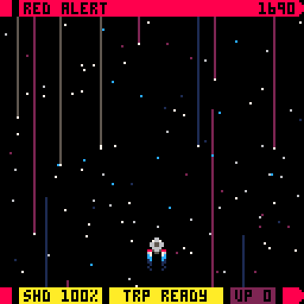

# Red Alert

_Red Alert_ is a tiny shmup for the [PICO-8](https://www.lexaloffle.com/pico-8.php) fantasy console. It is inspired by classic TV science fiction and is being developed by following Krystian Majewski's [PICO-8 Basic Shmup Tutorial](https://github.com/Krystman/lazydevs-pico8-basic-shmup).

The game planned as an endless level where you fight continous waves of enemies that get harder and harder. It might even get bosses at some point. Your main weapon is a phased laser that can be fired as often as you want. the secondary torpedoes can be fired once, before a cooldown is activated. You can fire this weapon again only once the cooldown is expired. Enemies have differing hit points and also hit differently based on their type. This is not a one-shot-and-you're-dead situation like in a classic shmup. Your ship has a shield that will get depleted by enemy hits and slowly recharges with time. If you get hit while your shield is down, you immediately die. Your main and secondary weapons both get upgraded automatically, as you progress in the game.

## Credits

Idea, code, art & sound effects: Fabian A. Scherschel

### Thanks

Special thanks: Krystian Majewski

Coding help: Jeff Thompson, Thego